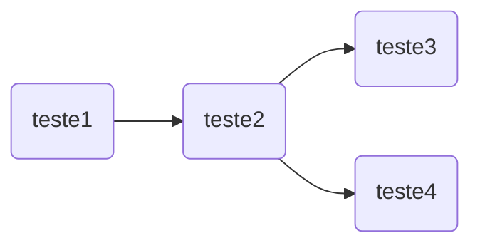

# curso_bioinformatica

## 1. Introduction



## Unix tutorial / Command Line
# Tutorial Linux  
# Open a web browser and find this github repository https://github.com/krother/bash_tutorial
# go to your home directory 
```
cd ~
git clone https://github.com/krother/bash_tutorial.git
´´´

* TODO: 

- [ ] Find the most recent directory in bash

```
LATEST_DIR=$(ls -td * | head -1)
```

## Alignment of raw reads


## BQSR

## Variant Calling

teste

`teste`

## Variant Filtering


