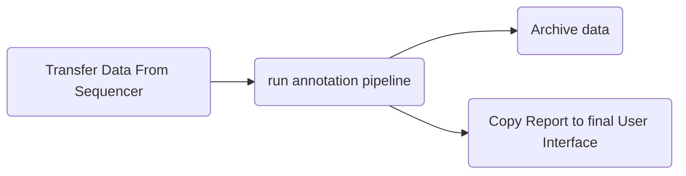

# curso_bioinformatica

## 1. Introduction



## Unix tutorial / Command Line

* TODO: 

- [ ] Find the most recent directory in bash

```
LATEST_DIR=$(ls -td * | head -1)
```

## Alignment of raw reads


## BQSR

## Variant Calling

## Variant Filtering
